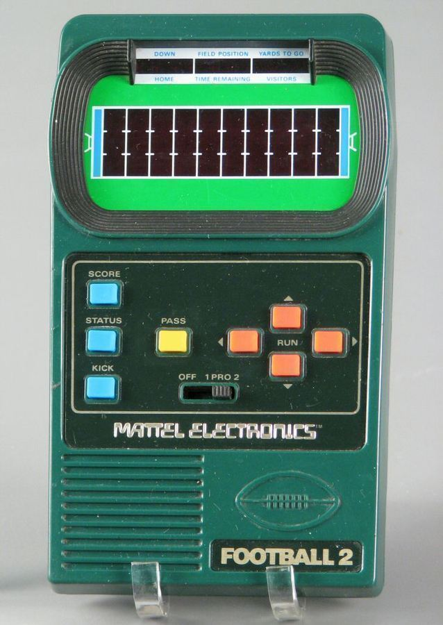
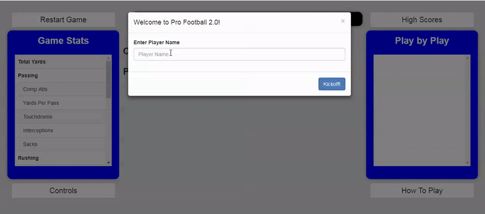

# Pro Football 2.0

## About
When I was a kid one of my prized possessions was a 1978 handheld Matell Pro Football 2. It had originally been my dad's but he had passed it down to me when once I was old enough to appreciate it. It was a deceptively simple approximation of football that included running, passing, interceptions and kicking. I spent many, many hours with that thing. Recently I got a hankering to play it once again but to my dismay could not find it anywhere. I then checked ebay to see if I could find one. To my dismay all the copies I could find were between $75 and $150. I didn't think I could justify spending that sort of money in order to experience a little nostalgia. If I could not find my copy and could not afford to buy another copy I decided to do the next best thing, recreate the game in JavaScript!

## Usage notes:
I have tried to make this game faithful to the original while also providing some improvements in game play. The wide receiver now runs real routes like streaks, deep crosses, drags and curls. I have tried to make defenders behave more like their real life counter points. Defensive linemen have a slow movement speed and a smaller range while defensive backs have a faster movement speed and a wider coverage radius. The linebacker moves at a random time to try to intercept passes. I have added advanced statistics tracking and keep track of the all time high scores as well. Please note this game requires use of a keyboard. Further information about gameplay is provided by clicking the "How to Play" button in game.

The game has been a hit at the office and I hope you will enjoy it too!

[Play now!](https://nhaney90.github.io/football-test/index.html)

## Libraries used:
JavaScript, jQuery, BootStrap and Require.js

## Future Improvements
This is not a completed project and I honestly may never finish it. The following are a list of improvements I would like to make:
* Complete animation for Field Goals
* Add sound effects for field goals, sacks, kickoffs, touchdowns and receptions
* Create field goal posts and stadium seats using Canvas
* Update colors and fonts - Yeah I know, they are pretty awful right now
* Add a touchdown banner and message

Do you have an improvement you would like to see? Let me know!

## Known Bugs
* Getting sacked on 4th down may not result in a turnover on downs. Have not investigated this issue yet.
* The field goal animation has not been completed. Attempting to kick a field goal breaks the game :(
* Sometimes the high score information does not load and the page needs to be refreshed. Must be some sort of timing issue.

Have you spotted a bug? Open an issue!

